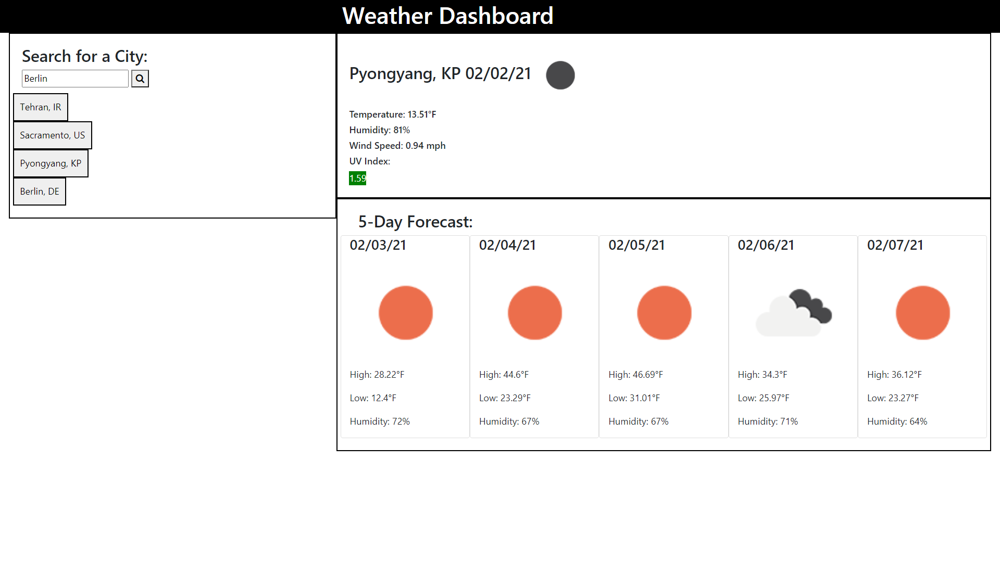

# Weather Dashboard

# The Assignment
Make an application where a user can find current & future weather info for whatever city they want, and info for previously searched cities is saved & accessible later on.

# Issues
This assignment had a lot of tricky parts to it, but the main challenge was figuring out how to use multiple API calls & feed info from one of them into another.

# Looking Forward
If I were to come back to this application, I would like to clean up the CSS a little bit. It could be prettier! I also want to add some sort of validation so that you can specify the country a city you're searching for is in so it doesn't pull up "Dublin, Ohio" when you meant "Dublin, Ireland", for example.

<!-- Screenshot of working application -->

# Installation

Simply follow this link and view the webpage.

https://dorrianweber.github.io/weatherDashboard/

# Usage

* Type in a city name & click the search icon to display current weather conditions & a 5-day forecast
* Click on any previously searched city to re-populate the page with that city's weather info

# Credits

I was helped in this assignment by my TA Ryan Skog in our tutoring session on 2/1/21.